# Notional System Design

This document describes the system that exists in the repository. It is an as-built design, not a proposal. Where an older architecture decision describes an earlier phase, the current source wins. Those differences are called out where they matter.

Notional does not send orders to Binance. Binance is an upstream public market-data provider only.

## 1. Overview

Notional is a paper crypto perpetual-futures trading platform. A user can sign up, receive virtual USDT, and simulate linear USDT-margined perpetual positions against live public market data. The platform exists so someone can practice order entry, margin, funding, and liquidation without custody, a wallet, a blockchain, or real money.

The backend owns every simulated trading decision. The browser displays server state and submits intents. It does not decide fill prices, margin, or liquidations.

Supported trading behavior today:

- One paper account per user, collateral currency USDT only.
- A one-time signup allocation of exactly `1000` virtual USDT, plus a configurable virtual faucet.
- A catalog of Binance USD-M crypto perpetuals (`PERPETUAL`, quote and margin asset `USDT`, underlying type `COIN`).
- `MARKET` and `LIMIT` paper orders, `BUY` or `SELL`, optional `reduceOnly`.
- One net position per account and instrument. Direction is the sign of quantity.
- `CROSS` and `ISOLATED` margin, integer leverage `1..100`.
- Immediate fills, resting limits, an in-process limit matcher, maintenance liquidation, and perpetual funding settlement.
- Account, order, execution, position, liquidation, and funding history over authenticated REST.
- Live quotes and candles over an in-process WebSocket, plus post-commit account invalidations.

There is no internal user-to-user matching engine. A paper fill takes the full order quantity at the current public best bid or best ask. Displayed bid and ask quantities are not a liquidity constraint. One user order never fills another user order, and no order is routed to Binance.

## 2. Design Goals

These goals are visible in the implementation.

- **Financial correctness.** PostgreSQL is the authority for balances, ledger entries, orders, executions, positions, reserved margin, isolated collateral, liquidations, and funding history. The in-memory market cache and the WebSocket fanout are not.
- **Exact decimal arithmetic.** Money, prices, quantities, PnL, margin, and funding move as decimal strings. Trading math uses an isolated `decimal.js` clone. JavaScript `Number` is not the canonical financial representation.
- **Transactional consistency.** A fill, its position update, wallet settlement, and ledger posting commit together or not at all. Replays of an already committed fill do not apply those effects again.
- **Deterministic paper execution.** Fill price is a pure function of side and a fresh best bid or best ask. Mark price is used for risk, unrealized PnL, and minimum-notional checks, never as the fill price.
- **Fail closed on missing market data.** Stale or absent mark or BBO rejects the operation that needs it. Readiness of the process does not mean the market feed is fresh.
- **Real-time market updates without giving the browser authority.** The API keeps one process-local market store and fans coalesced snapshots to browsers. Reconnect requires REST resynchronization for financial state.
- **Modular monolith.** One Fastify process owns HTTP, WebSockets, catalog sync, the market store, the limit matcher, and the funding and liquidation scanners. Workspace packages separate contracts, persistence, and pure math.
- **Browser isolation from the upstream market provider.** The SPA talks only to Notional REST and Notional WebSockets. It does not open a Binance socket and it does not hold a Binance API key.

## 3. High-Level Architecture

Rendered figures are in `docs/diagrams/`. The files in `docs/diagrams/source/` are the Mermaid inputs for the SVG and PNG images. Each collapsed source block matches that file.


<details>
<summary>View Mermaid source</summary>

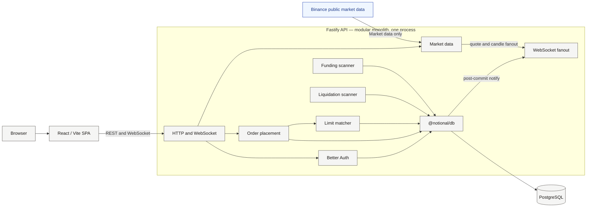

</details>

The API process is the only component that talks to Binance and the only component that writes financial state. Application services persist through `@notional/db`. WebSocket fanout delivers post-commit private invalidations and live quotes and candles; it does not write PostgreSQL. Section 4 is the complete package graph, including the SPA import of `@notional/trading`. `server.ts` constructs the market-data runtime, one `RealtimeRuntime`, the limit matcher, the liquidation scanner, and the funding scanner, then injects them into `buildApp`. `buildApp` registers HTTP and WebSocket routes. It does not open a second Binance connection and it does not start the scanners.

Redis appears in local `docker-compose.yml` and is unused by the application. It is not in the request path, not a cache for orders, and not financial storage.

## 4. Repository / Package Architecture

The repository is a pnpm workspace (`pnpm-workspace.yaml`: `apps/*` and `packages/*`). Node 22+ and pnpm 12.4.1 are the toolchain. Production runs compiled JavaScript. `tsx` is development-only.

| Package | Role | Runtime dependencies |
| --- | --- | --- |
| `apps/web` (`web`) | React 19 SPA, Vite, React Router, TanStack Query, Zustand, Lightweight Charts | `@notional/contracts`, `@notional/trading`, `better-auth`, `decimal.js` |
| `apps/api` (`api`) | Fastify modular monolith | `@notional/contracts`, `@notional/db`, `@notional/trading`, `better-auth`, `zod`, Fastify plugins |
| `packages/contracts` (`@notional/contracts`) | Shared request and response types, candle intervals, realtime protocol version | none |
| `packages/db` (`@notional/db`) | Drizzle schema, SQL migrations, ledger and lock helpers, `MoneyDecimal` | `drizzle-orm`, `pg`, `decimal.js` |
| `packages/trading` (`@notional/trading`) | Pure trading math. No I/O, no clock, no environment | `decimal.js` only |


<details>
<summary>View Mermaid source</summary>

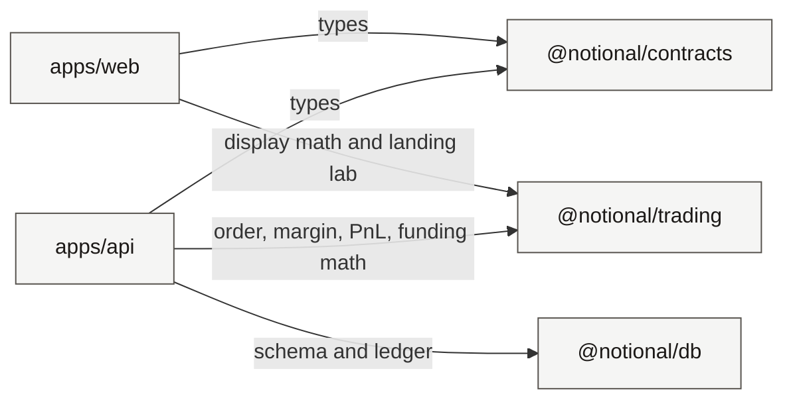

</details>

Intentional boundaries that the code keeps:

- `@notional/trading` does not import the API, the database package, contracts, Fastify, PostgreSQL, Redis, or Binance.
- `@notional/db` does not import `@notional/trading`. Persistence quantization for fills is applied by the API before it writes strings that already fit `NUMERIC(38,18)`.
- `apps/web` does not import `@notional/db` or API internals.
- The browser does not place orders by calling trading-math functions. `OrderForm` posts a `CreateOrderRequest`.

`apps/web` does import `@notional/trading`. That is narrower than ADR-037, which says the SPA must not import it. Current use is display comparison (`isDecimalGte`, `isDecimalLte`) and the landing-page leverage lab. Indicator recurrence uses a separate `decimal.js` clone inside `apps/web`, not `TradingDecimal`. The trading terminal does not compute margin, available balance, or unrealized PnL for the desk.

## 5. Backend Architecture

`apps/api/src/server.ts` is the process entry. `apps/api/src/app.ts` is `buildApp`.

Construction order in `startServer`:

1. `createMarketDataRuntime` — catalog sync, Binance REST bootstrap, mark stream, book-ticker feed, refcounted kline feed. Accepted book, mark, and candle callbacks are wired later.
2. `createRealtimeRuntime` — one in-process fanout. Session lookup for `/ws/account` calls `auth.api.getSession`.
3. `createLimitOrderMatcher` — in-process, at most four symbol cycles at once (`DEFAULT_MAX_CONCURRENT_SYMBOL_CYCLES = 4`).
4. `createLiquidationScanner` and `createFundingScanner`.
5. Callbacks: a newer BBO schedules the matcher and notes the book for fanout; a newer mark notes the mark; an accepted kline becomes `market.candle`; a newly committed `OPEN` limit schedules the matcher; committed private effects go to the account fanout.
6. `buildApp({ marketData, realtime, onOpenOrderCommitted, onPrivateCommitted })`.
7. `listenThenBootstrapRuntime` listens, then starts market data and the scanners. Scanners are not started inside `buildApp`.

`buildApp` registers, in order:

- Helmet. Content-Security-Policy is off on the API. HSTS is optional (`ENABLE_HSTS`, max-age `15552000`) and is used when the auth URL is HTTPS in production.
- CORS with `origin` exactly `WEB_ORIGIN`, `credentials: true`, and `Idempotency-Key` in `allowedHeaders`.
- `@fastify/rate-limit` with `global: false`. Limits are attached per route family.
- The error handler.
- An `onResponse` access log.
- Better Auth at `/api/auth/*`.
- WebSocket routes when a `RealtimeRuntime` was injected.
- `GET /health` and `GET /ready`.
- Authenticated `/api/*` routes.

JSON bodies are capped at 32 KiB (`JSON_BODY_LIMIT_BYTES`). `trustProxy` is the boolean `TRUST_PROXY` (default `false`). The env parser accepts only `true` or `false`.

Route modules are plain Fastify handlers, not a plugin per domain: `account.ts`, `instruments.ts`, `market-data.ts`, `orders.ts`, `executions.ts`, `positions.ts`, `margin-settings.ts`, `liquidations.ts`, `funding.ts`. Domain work lives under `services/`. Validation of order bodies uses Zod. Shared DTO shapes live in `@notional/contracts`.

The framework error handler maps body-too-large to `PAYLOAD_TOO_LARGE`, validation failures and other 4xx to `INVALID_REQUEST`, rate limits to `429 RATE_LIMITED`, and unexpected failures to `500 INTERNAL_ERROR`. Trading and account errors are mapped in the route handlers (`401`, `400`, `404`, `409`, `503`) and are not rewritten by that handler.

Database access is one `pg` pool (`DATABASE_POOL_MAX`, default 10) and one Drizzle client in `@notional/db`. Financial mutations call `db.transaction`. Low-level helpers accept that transaction executor and do not commit on their own.

Configuration is parsed once in `apps/api/src/env.ts`. Required values include `DATABASE_URL`, `BETTER_AUTH_SECRET` (minimum 32 characters), `BETTER_AUTH_URL`, `WEB_ORIGIN`, and `FAUCET_AMOUNT`. Binance bases, stale thresholds, scan intervals, and WebSocket timings have defaults. Production rejects the example auth secret, requires HTTPS non-localhost origins, and refuses a database name of `notional_test`.

Authenticated route table:

| Method and path | Role |
| --- | --- |
| `GET /api/me` | Session user profile |
| `GET /api/account` | Paper account read. `409 ACCOUNT_NOT_INITIALIZED` when signup allocation is missing |
| `POST /api/account/initialize` | Idempotent signup allocation |
| `POST /api/account/faucet` | Virtual faucet claim |
| `GET /api/account/funding` | Signup and faucet history |
| `GET /api/funding` | Perpetual funding history |
| `GET /api/instruments` | Active catalog, `symbol ASC` |
| `GET /api/instruments/:symbol` | Any status. Missing is `404 INSTRUMENT_NOT_FOUND` |
| `GET /api/market-data/status` | Feed status |
| `GET /api/market-data/:symbol` | Fresh mark and BBO snapshot |
| `GET /api/market-data/:symbol/candles` | Historical candles proxied from Binance |
| `GET /api/orders`, `GET /api/orders/:id` | Account-scoped order reads |
| `POST /api/orders` | Placement. Requires `Idempotency-Key` |
| `POST /api/orders/:id/cancel` | Cancel an `OPEN` limit |
| `GET /api/executions`, `GET /api/executions/:id` | Account-scoped fills |
| `GET /api/positions`, `GET /api/positions/:symbol` | Open positions, with unrealized PnL when mark is fresh |
| `GET /api/liquidations` | Liquidation history |
| `GET /api/margin-settings/:symbol`, `PUT /api/margin-settings/:symbol` | Per-symbol mode and leverage |

`GET /health` and `GET /ready` are unauthenticated. `/api/auth/*` is the Better Auth surface. `GET /ws/market` is unauthenticated and origin-gated. `GET /ws/account` requires a session and an initialized paper account.

Default abuse limits in `rate-limit.ts` (not financial authority): sign-up 5 per 15 minutes, sign-in 10 per 15 minutes, other auth 60 per minute, orders 30 per minute, cancels 60 per minute, faucet 5 per hour, initialize 10 per hour, margin settings 20 per minute, reads 120 per minute, WebSocket upgrades 20 per minute. Auth limits key on IP. User limits key on the authenticated user id. With `TRUST_PROXY=false`, that IP is the immediate peer.

Shutdown (`shutdown.ts`) sets the process not-ready, closes WebSockets, stops scheduling, drains scanners and catalog sync, finishes HTTP, drains the matcher, stops market data, and calls `pool.end()` last. `SHUTDOWN_TIMEOUT_MS` defaults to 15000.

## 6. Authentication and Sessions

Authentication is Better Auth 1.7 with the Drizzle adapter on PostgreSQL. Email and password are enabled. No social providers are configured. The application does not issue JWTs, does not store tokens in `localStorage`, and does not implement its own password hashing or cookie signing.

Tables: `user`, `session`, `account`, `verification`. IDs are UUIDs (`advanced.database.generateId: "uuid"`). `account` here is Better Auth's credential record, not the paper trading account.

Session lookup is `auth.api.getSession` from the request cookie. `requireAuth` stores the session on `request.auth` or returns `401 { error: "Unauthorized" }`. The account WebSocket uses the same lookup during the HTTP upgrade.

Cookie attributes from `authCookieSettings`:

- `httpOnly: true`
- `sameSite: "lax"`
- `path: "/"`
- `secure` when `BETTER_AUTH_URL` is `https:`
- no `Domain` attribute (host-only)
- session `expiresIn` is 7 days (`AUTH_SESSION_EXPIRES_IN_SECONDS`)

`trustedOrigins` is exactly `[WEB_ORIGIN]`. Auth handler requests are rebuilt against canonical `BETTER_AUTH_URL`. The handler strips `Host` and forwarded headers so the cookie and callback URL do not follow a client-supplied host. That matches `TRUST_PROXY=false`.

Sign-up does not create a paper account. Better Auth commits `user` first. Financial provisioning is a later `POST /api/account/initialize`. A user with no paper account is a recoverable gap, not a half-written ledger.

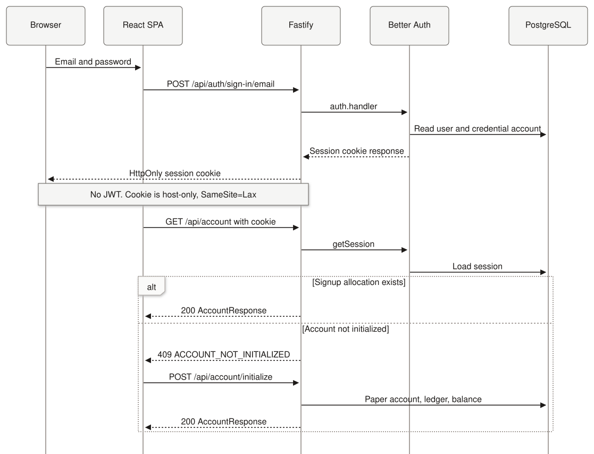

<details>
<summary>View Mermaid source</summary>

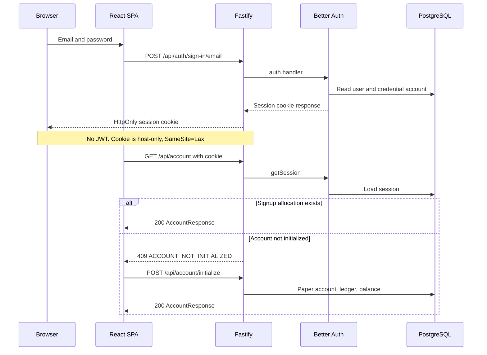

</details>

Sign-out is Better Auth's sign-out through the same `/api/auth/*` mount. The SPA then stops sockets, clears the TanStack Query cache, and navigates to `/signin`. Protected pages use `authClient.useSession()` and redirect when the session is absent. `GET /api/me` is available but is not a second cached session store.

The browser cannot read an HTTP status from a rejected WebSocket upgrade. The SPA therefore bootstraps the paper account with REST before it opens `/ws/account`, and it treats a failed account handshake as a session and account re-check rather than as a status code it can branch on.

## 7. Market Data Architecture

Binance's role is public USD-M market data. The API uses unsigned `GET` requests and public WebSocket streams. There is no API key, secret, signed request, listen key, or user-data stream. The browser never talks to Binance. Searches of `apps/web` find the Binance hosts only in copy and in tests that assert those hosts are absent from the client.

Default endpoints, all overridable by environment:

- REST `https://fapi.binance.com`
- Mark stream `wss://fstream.binance.com/market/stream?streams=!markPrice@arr@1s`
- Public streams `wss://fstream.binance.com/public/ws`

REST methods in `rest-client.ts`:

| Client method | Binance path | Use |
| --- | --- | --- |
| `getExchangeInfo` | `/fapi/v1/exchangeInfo` | Catalog sync |
| `getPremiumIndex` | `/fapi/v1/premiumIndex` | Mark, index, funding bootstrap |
| `getBookTicker` | `/fapi/v1/ticker/bookTicker` | BBO bootstrap |
| `getKlines` | `/fapi/v1/klines` | Historical chart candles |
| `getFundingRate` | `/fapi/v1/fundingRate` | Realized funding history |
| `getMarkPriceKlines` | `/fapi/v1/markPriceKlines` | Settlement mark candle |

WebSocket subscriptions:

- One market connection for `!markPrice@arr@1s` (all catalog symbols, about 1 second).
- One or more public connections for `<symbol>@bookTicker` on every known catalog symbol, `ACTIVE` and `INACTIVE`. All-market `!bookTicker` is not used, because that stream is too slow for execution and liquidation.
- Refcounted `<symbol>@kline_<interval>` subscriptions, opened only while at least one browser candle subscriber holds the interval.

Book and kline control messages are Binance `SUBSCRIBE` / `UNSUBSCRIBE`, chunked (50 streams, 250 ms delay), at most 200 streams per connection. Reconnect uses exponential backoff with jitter, capped by `BINANCE_WS_RECONNECT_MAX_MS` (default 30 seconds), generation protection, and rotation before the 24-hour server lifetime (`WS_CONNECTION_MAX_MS`).

Catalog eligibility (`map-exchange-info.ts`) requires all of:

- `contractType === "PERPETUAL"`
- `quoteAsset === "USDT"`
- `marginAsset === "USDT"`
- `underlyingType === "COIN"`
- usable `PRICE_FILTER`, `LOT_SIZE`, `MARKET_LOT_SIZE`, and `MIN_NOTIONAL`

`TRADING` maps to `ACTIVE`. Any other Binance status maps to `INACTIVE`. TradFi perpetuals and index underlyings are skipped. The symbol stored on `instrument.symbol` is the Binance symbol. There is no second `binance_symbol` column.

A catalog cycle aborts, leaving PostgreSQL unchanged, if the snapshot is invalid, any eligible candidate has a malformed filter, or the mapped set is empty. A successful cycle locks existing instrument rows `ORDER BY id ASC FOR UPDATE`, upserts by symbol (preserving `id`), inserts new symbols only after that lock, and marks missing rows `INACTIVE`. It does not delete rows and it does not lock accounts, positions, or orders. Sync runs about once per `INSTRUMENT_SYNC_INTERVAL_MS` (default 1 hour). A failed initial sync does not block API startup.

`instrument` stores identity, assets, status, and filters only. Live prices are not columns.

The process-local store (`market-data-store.ts`) keeps, per known symbol:

- Mark: `markPrice`, `indexPrice`, `fundingRate`, `nextFundingTime`, `markEventTime`, `markReceivedAt`
- Book: best bid and ask price and quantity, `bookUpdateId`, `bookEventTime`, `bookReceivedAt`

Replace rules:

- Mark: accept the first snapshot, then only a strictly newer `markEventTime`. An equal or older event does not refresh `markReceivedAt`.
- Book: accept the first snapshot, then only a strictly newer `bookUpdateId` (`lastUpdateId` from REST, `u` from the WebSocket). Event timestamps do not order the book. A late REST bootstrap cannot overwrite a newer socket book.

Freshness is local receive time: `now - receivedAt <= threshold`. Exchange event time is not the ageing clock. Defaults are 10 seconds for mark and book, independently (`MARKET_DATA_MARK_STALE_MS`, `MARKET_DATA_BOOK_STALE_MS`). After a disconnect, snapshots stay in memory and age out.

`GET /api/market-data/:symbol` requires both a fresh mark and a fresh book, otherwise `503 MARKET_DATA_UNAVAILABLE`. Internal readers can ask for `getFreshMark` and `getFreshBook` separately. There is no single authoritative `price`.

Price roles:

| Use | Source |
| --- | --- |
| Market buy, and a marketable buy limit | Fresh best ask |
| Market sell, and a marketable sell limit | Fresh best bid |
| Unrealized PnL, margin, liquidation trigger | Fresh mark |
| Market minimum notional | Fresh mark |
| Limit minimum notional | The limit price |
| Funding payment | Realized Binance `fundingRate` plus the exact preceding 1-minute mark-price candle |
| Index, live funding rate, `nextFundingTime` on the mark stream | Reference and schedule hint, not a fill price |


<details>
<summary>View Mermaid source</summary>

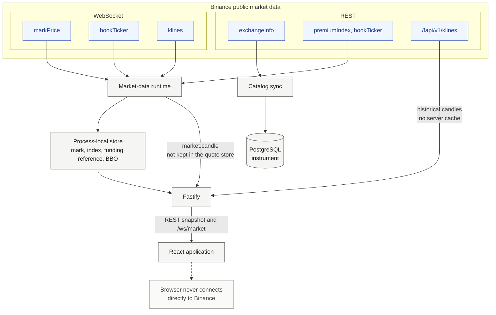

</details>

Losing the API process loses the live cache. The next process rebuilds it from REST bootstrap plus the WebSocket. PostgreSQL does not store the lost quotes.

## 8. Candle / Chart Data Architecture

Historical candles and live candles are different paths. Neither is financial authority.

### Historical candles

`GET /api/market-data/:symbol/candles` is authenticated. It checks that the symbol exists, then calls Binance `GET /fapi/v1/klines`. There is no server-side candle cache.

Query rules in `market-data.ts`:

| Parameter | Default | Constraint |
| --- | --- | --- |
| `interval` | `15m` | `1m`, `5m`, `15m`, `1h`, `4h`, `1d` |
| `limit` | `500` | Integer `1..1500` |
| `before` | omitted | Optional exclusive open-time bound. Sent to Binance as `endTime = before - 1` |

`parse-klines.ts` reads open time, open, high, low, close, volume, and close time. OHLC and volume stay decimal strings (`MoneyDecimal` parsers). A malformed row fails the request with `503 MARKET_DATA_UNAVAILABLE`. If `before` is set and any returned candle has `openTime >= before`, the response is rejected the same way. That keeps a backfill page strictly older than the caller's cursor.

The chart's first page asks for `TRADE_CHART_LIMIT` (500). Scrolling back requests another page with `before` set to the oldest loaded open time. The SPA keeps at most `TRADE_CHART_MAX_CANDLES` (10,000) candles and stops requesting once that cap is reached. Older rows are trimmed when a live append would exceed the cap.

### Live candles

A browser sends `market.candles.subscribe` with a symbol and interval. The realtime runtime reference-counts that pair and calls `acquireKline` / `releaseKline` on the market-data runtime. The first subscriber adds `<symbol>@kline_<interval>` on the public Binance socket. The last subscriber removes it. Each market socket may hold two candle subscriptions (`MAX_CANDLE_SUBSCRIPTIONS`).

Accepted klines are parsed in `parse-live-kline.ts` and fanned out as `market.candle` with string OHLC and volume plus `isClosed`. Fanout keeps at most one closed candle and one in-progress candle per client. A slow market socket can skip a coalesced BBO or mark frame. Persistent candle overflow closes that socket with `4429`.

The SPA merges `market.candle` into the TanStack Query candle cache with `mergeLiveCandle`. Strings stay strings in that cache. On market reconnect, after `hello`, the client resubscribes and refetches; `mergeLatestSnapshot` reconciles the REST page with candles already held.

### Chart rendering

`MarketChart` uses Lightweight Charts. The same candle series drives two display modes stored in `localStorage` (`notional.trade-chart.preferences.v1`): candlesticks, or a line of closes. Volume is a histogram on a separate price scale. Preferences also store indicator toggles and periods. They do not store drawings, balances, or PnL.

Indicators, calculated in the browser from candle close strings:

- SMA, EMA, RSI, MACD, Bollinger Bands
- A dedicated `IndicatorDecimal` clone: precision 128, `ROUND_HALF_UP`, output scale 18
- Recurrence state stays on that clone. Serialized point strings are not fed back into the recurrence

Drawing tools are `select`, `trend-line`, and `horizontal-line`. Geometry is chart time and a JavaScript `number` price. Drawings are session UI state per symbol. They are not orders and they are not persisted with chart preferences.

The numeric conversion boundary is explicit. `to-chart-candles.ts` and `to-chart-indicators.ts` call `Number(...)` only to produce Lightweight Charts coordinates. Those numbers are not submitted as order prices, quantities, or PnL.

The trade-desk "live / stale" badge (`TRADE_MARK_STALE_MS = 10000`) compares wall clock to the mark **event** time for display. Server trading freshness uses **receive** time. The badge does not authorize a fill.


<details>
<summary>View Mermaid source</summary>

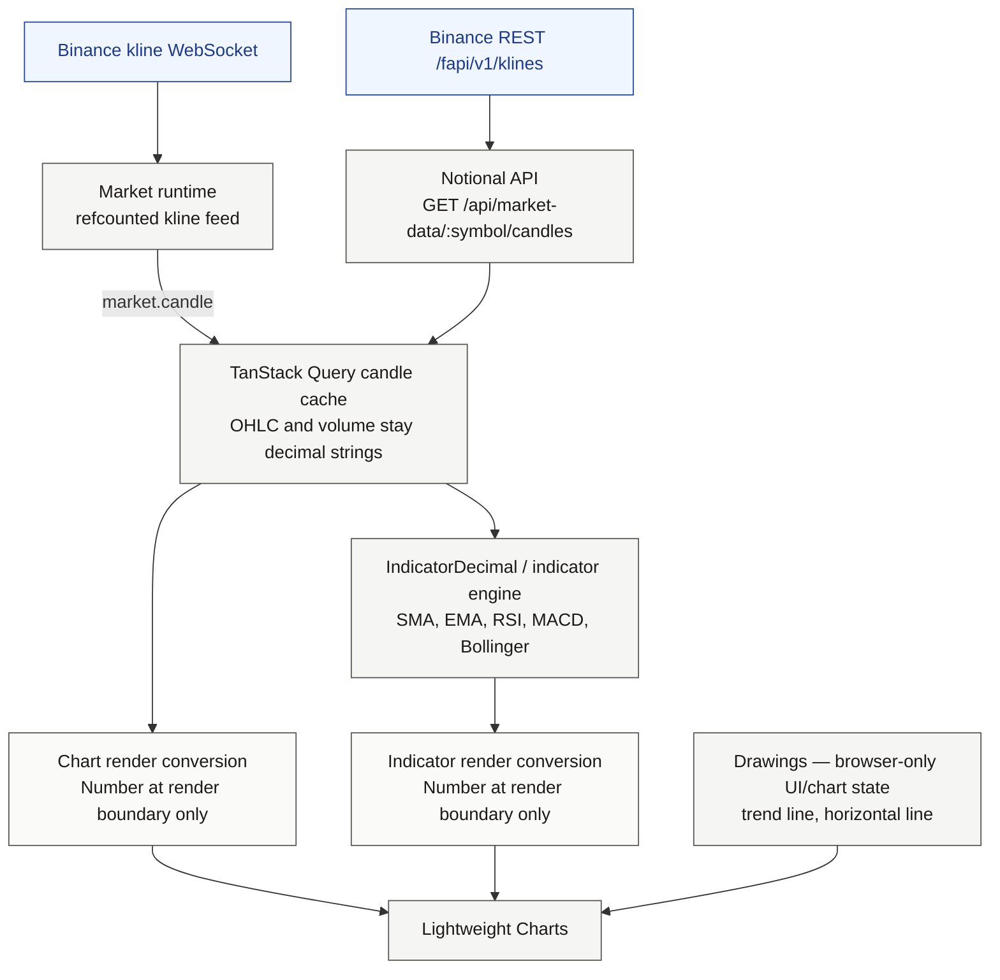

</details>

## 9. Trading Domain

Terminology below is the code's.

**Instrument.** Row in `instrument`. Stable UUID `id`, canonical uppercase `symbol`. `ACTIVE` may take new risk. `INACTIVE` rejects new `OPEN`, `INCREASE`, and `REVERSE`, but still allows `reduceOnly` `REDUCE` or `CLOSE`, and still allows liquidation, when the required BBO is fresh. Rows are never deleted.

**Paper account.** Row in `paper_account`. One per `user_id`. `currency` is `USDT`. `balance` is wallet cash, a projection of the ledger, not equity and not unrealized PnL. Status is `ACTIVE` or `SUSPENDED`. Suspended users cannot place orders or claim the faucet. They can still be liquidated, and they can still cancel resting orders.

**Order.** Row in `trade_order` (the table is not named `order`). Side `BUY` or `SELL`. Type `MARKET` or `LIMIT`. `quantity` is a positive size. Direction is not a signed order quantity. `reduce_only` defaults to false. `origin` is `USER` or `LIQUIDATION`. Status is only `OPEN`, `FILLED`, or `CANCELLED`.

- `MARKET` may only be persisted as `FILLED`. It is never queued.
- `LIMIT` may be `OPEN`, `FILLED`, or `CANCELLED`. There is no time-in-force column. Resting limits behave as good-till-cancelled.
- There is no `PENDING`, `PARTIALLY_FILLED`, remaining quantity, or fee.

**Execution.** Row in `execution`. One per filled order (`UNIQUE(order_id)`). Columns are `id`, `order_id`, `quantity`, `price`, `executed_at`. The quantity is the full order quantity. The row is immutable. `executed_at` is sampled once as `clock_timestamp() AT TIME ZONE 'UTC'`.

**Position.** Row in `trading_position`. One per `(paper_account_id, instrument_id)`. Created lazily by `ensurePosition` on first use and kept after the position goes flat. Application type `Position`.

Signed quantity:

- `quantity > 0` long
- `quantity < 0` short
- `quantity = 0` flat, and `entry_price` is null

A fill quantity is always positive. `BUY` adds `+fillQty`. `SELL` adds `-fillQty`. `nextQty = currentQty + signedFillQty`.

`applyFillToPosition` classifies the transition:

| Transition | Entry | Realized on this fill |
| --- | --- | --- |
| `OPEN` | Fill price | 0 |
| `INCREASE` | Quantity-weighted average of old entry and fill price | 0 |
| `REDUCE` | Unchanged | Closed quantity only |
| `CLOSE` | Null, quantity 0, row kept | Closed quantity |
| `REVERSE` | Residual opens at the fill price. Old entry is not blended | Closed quantity |

`REVERSE` is allowed in `CROSS`. `ISOLATED` plus `REVERSE` is `ISOLATED_REVERSE_NOT_SUPPORTED`. A resting isolated order that later classifies as `REVERSE` stays `OPEN`.

**Reduce-only.** Placement classifies against the locked position. Only `REDUCE` and `CLOSE` may proceed. `OPEN`, `INCREASE`, and `REVERSE` return `REDUCE_ONLY_VIOLATION`. The matcher classifies again at execution time. If the order no longer reduces, it stays `OPEN` and is not auto-cancelled. A reduce-only exit skips lot size and minimum notional. A limit still needs the price filter and a fresh book. A market exit still needs a fresh book. Reduce-only resting limits reserve `0`.

**Leverage and margin mode** live on the position row, including while flat: `margin_mode` `CROSS` or `ISOLATED`, `leverage` integer `1..100` default `1`, `isolated_margin` numeric. Settings can change only while the position is flat and no `OPEN` order exists for that account and instrument.

**Order lifecycle**

```text
MARKET  --> validate --> FILLED + execution     (or reject, no row)
LIMIT   --> marketable --> FILLED + execution   (or reject, no row)
LIMIT   --> not marketable --> OPEN
OPEN    --> BBO crosses --> FILLED + execution
OPEN    --> user cancel --> CANCELLED
OPEN    --> liquidation cancel --> CANCELLED
```

Failed validation inserts nothing, so the idempotency key is not consumed. `Idempotency-Key` is client-supplied, printable non-whitespace ASCII, length 1..128, unique per paper account. The fingerprint is instrument, side, type, canonical quantity, canonical limit price or null, and reduce-only. Status, timestamps, and execution price are not part of the fingerprint. First success is HTTP `201`. A same-fingerprint replay is `200` and does not re-validate margin or re-price. A different body with the same key is `409 IDEMPOTENCY_KEY_REUSED`.

`reserved_margin` is a placement-time collateral reservation on a non-reduce `OPEN` limit. It is not wallet cash and it is not on `OrderResponse`. `FILLED` and `CANCELLED` rows store `0`.

## 10. Order Placement Flow

`POST /api/orders` enters `postOrder` in `orders.ts`, which calls `placeOrder` in `services/order-placement.ts`.

Before any account lock, on the happy replay path:

1. Require a session.
2. Parse `Idempotency-Key` and the Zod `MARKET` | `LIMIT` body.
3. Load the initialized paper account (signup allocation must exist).
4. Resolve the instrument by symbol.
5. If an order already exists for `(paper_account_id, idempotency_key)` and the fingerprint matches, return it. No market read, no lock, no second fill.

A new placement opens one PostgreSQL transaction:

1. `lockPaperAccountById` (`FOR UPDATE`).
2. Reject a missing signup allocation or a `SUSPENDED` account.
3. Re-read the idempotency key under the lock. A concurrent winner becomes a replay.
4. `settleDueFundingForAccountInTx` with `extraInstrumentIds` set to this instrument. That samples `financialNow`, share-locks the relevant instruments, `ensurePosition`s the target, and locks positions. Due funding inside the window settles in this same transaction or the placement fails with `FUNDING_DATA_UNAVAILABLE`.
5. Classify the transition. Enforce reduce-only, isolated-reverse, and inactive-instrument policy.
6. Validate filters in `@notional/trading`.
7. Read a fresh book from the in-memory store. A market order that is not a reduce-only exit also needs a fresh mark for minimum notional.
8. If the limit is not marketable, compute rounded-up reserved margin and require `crossAvailableBalance >= reservedMargin`, then `insertOpenLimitOrder`.
9. If the order is marketable, take the BBO execution price, `insertFilledOrderWithExecution`, then `applyCreatedFillEffectsInTx`: position update, realized settlement when the delta is non-zero, and a post-fill cross check for `OPEN`, `INCREASE`, and `REVERSE`.
10. Commit, or roll back the entire transaction on any throw.

`onOpenOrderCommitted` runs only after commit, and only when this call created an `OPEN` limit. Replays do not schedule the matcher. The matcher also runs when the store accepts a newer BBO for that symbol.

The matcher (`limit-matcher.ts`) processes `OPEN` limits for the symbol in `(created_at, id)` order. Each candidate is its own transaction: lock the account, run the funding barrier, lock the order, re-read a fresh book, re-check marketability and reduce-only, `completeOpenLimitOrder`, then the same created-fill effects. `INSUFFICIENT_MARGIN`, `MARKET_DATA_UNAVAILABLE`, and `FUNDING_DATA_UNAVAILABLE` roll that candidate back and leave the order `OPEN`. The cycle continues. One symbol has one cycle in flight and at most one follow-up cycle with the newest store state.

Cancel is `POST /api/orders/:id/cancel`. It locks only the order row. `OPEN` becomes `CANCELLED` and `reserved_margin` becomes `0`. A second cancel of `CANCELLED` returns `200`. `FILLED` is `ORDER_NOT_CANCELLABLE`. Suspended accounts and inactive instruments may cancel.

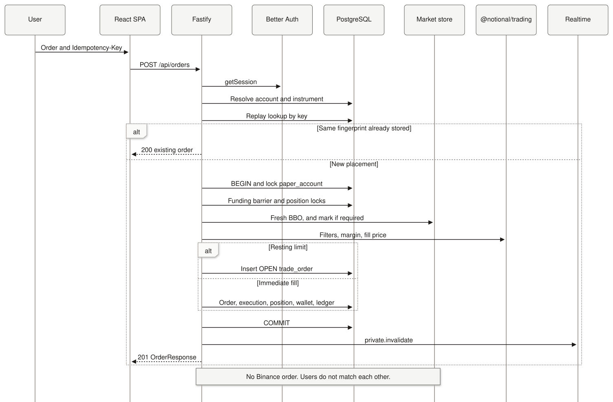

<details>
<summary>View Mermaid source</summary>

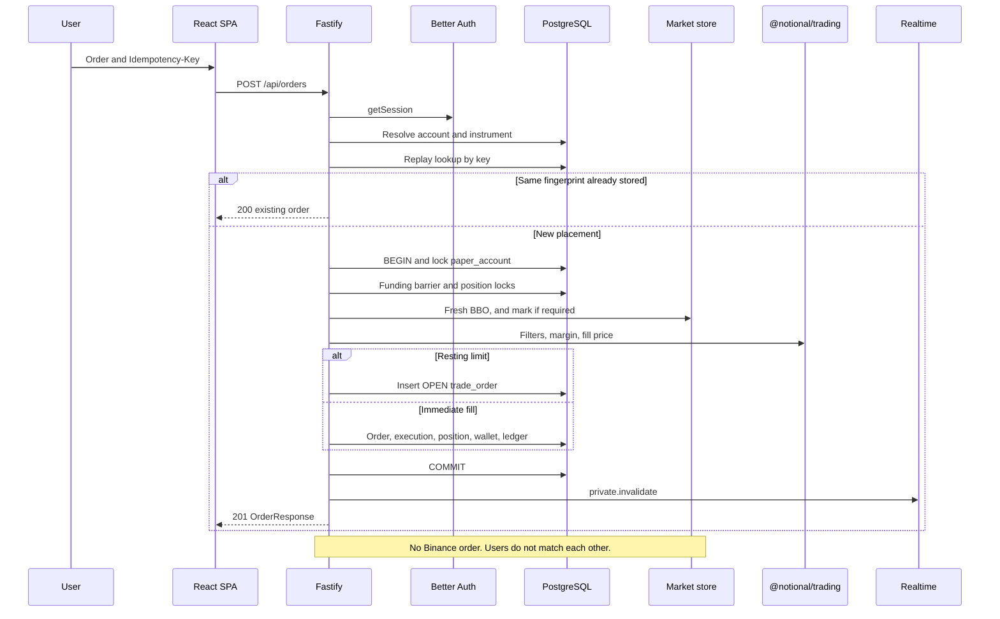

</details>

Validation that can reject before a row exists includes `INVALID_ORDER`, `IDEMPOTENCY_KEY_REQUIRED`, `IDEMPOTENCY_KEY_INVALID`, `ACCOUNT_NOT_INITIALIZED`, `ACCOUNT_SUSPENDED`, `INSTRUMENT_NOT_FOUND`, `INSTRUMENT_INACTIVE`, `REDUCE_ONLY_VIOLATION`, `ISOLATED_REVERSE_NOT_SUPPORTED`, `INSUFFICIENT_MARGIN`, `MARKET_DATA_UNAVAILABLE`, and `FUNDING_DATA_UNAVAILABLE`. A throw inside the transaction rolls back the order, execution, position, wallet, and ledger together. Realtime publication happens after commit. If publication throws, `safeOnPrivateCommitted` logs it and does not turn the HTTP call into a 500. The committed financial state remains.

## 11. Financial Precision Model

Three decimal stacks exist. They are not interchangeable.

| Layer | Type | Settings | Role |
| --- | --- | --- | --- |
| PostgreSQL | `NUMERIC(38,18)` | 38 digits, 18 fractional, Drizzle mode `string` | Stored money, prices, quantities, PnL, margin, funding |
| `@notional/db` | `MoneyDecimal` | `decimal.js` clone, precision 50, default rounding `ROUND_HALF_UP` | Ledger and config boundary. `assertFitsNumeric3818` rejects scale above 18 or integer overflow. It does not round |
| `@notional/trading` | `TradingDecimal` | precision 80, `ROUND_HALF_EVEN` | One trading transition. Public functions take and return decimal strings |
| Chart indicators | `IndicatorDecimal` | precision 128, `ROUND_HALF_UP` | Browser indicator recurrence only |

`NUMERIC_PRECISION = 38`, `NUMERIC_SCALE = 18`, and `NUMERIC_INTEGER_DIGITS = 20` are duplicated in `@notional/trading` and `@notional/db` so the math package does not import the database package. They must stay aligned.

Canonical trading output uses plain decimal form. Mathematical zero is `"0"`, never `"-0"`. Scientific notation is rejected on input and not emitted on output. Trailing zeros are not padded by the math helpers. `"1"`, `"1.0"`, and `"1.00"` compare equal for idempotency fingerprints.

JavaScript `Number` is prohibited as the canonical value for balances, prices, quantities, PnL, margin, and funding. Trading tests reject `Number(`, `parseFloat`, and `parseInt` inside the settlement helpers. The web financial-safeguard test rejects those coercions on order and position display paths that must stay strings.

`Number` is permitted for:

- Configuration that is not money: ports, pool size, rate-limit windows, timeouts.
- Funding timestamp helpers that check `Number.isSafeInteger` and compute the expected 1-minute candle close with `Math.floor`.
- Chart and landing geometry, after a string has already been accepted (`to-chart-candles.ts`, indicator plot mapping, landing sparkline coordinates).
- Integer leverage in JSON. Leverage is a small integer, not a decimal amount.

Rounding rules:

- Quantities and execution prices must already fit `NUMERIC(38,18)`. `applyFillToPosition` does not quantize them. Overflow throws.
- Weighted-average entry and the per-fill realized delta are quantized with `quantizeToNumeric3818` (`ROUND_HALF_EVEN` to 18 places) at persist time, then checked for integer overflow.
- Cumulative `realized_pnl` is `addNumeric3818Exact` of the current stored value and that quantized delta. The sum is not rounded again.
- Collateral requirements use `quantizeCollateralRequirementToNumeric3818` (`ROUND_UP` to 18 places). That includes `reserved_margin` and persisted isolated margin. PnL does not use round-up.
- Minimum notional compares unrounded `abs(quantity) × price` to `minNotional`. Tick and step checks use decimal modulo, not JavaScript `%` and not an epsilon: `(price - minPrice) mod tickSize == 0`, and the same shape for quantity.
- Funding rate and settlement mark are quantized `ROUND_HALF_EVEN` before they are stored. `abs(rate) < 1` is required before and after quantization. The payment is quantized once.

Precision 80 covers one transition whose inputs already fit `NUMERIC(38,18)`: a product of two such values needs up to 76 significant digits, and a sum of two products needs one more. It is not a claim that arbitrary chains of unquantized intermediates stay exact.

The authority loop is: committed PostgreSQL row, one `applyFillToPosition`, explicit quantization, commit. The next fill uses the stored entry price, not a hidden higher-precision history.

API JSON uses those decimal strings. `PositionResponse.unrealizedPnl` is computed at read time with `calculateUnrealizedPnl` and is omitted as `null` when the mark is stale. It is not a stored column. `AccountResponse.realizedPnl24h` is a decimal string.

## 12. Transaction and Concurrency Model

PostgreSQL is the concurrency boundary. The pool does not set an isolation level. Transactions therefore use the server default, READ COMMITTED, which is also what the architecture decisions rely on. There are no advisory locks and no Redis locks.

The permanent order, documented on `lockInstrumentByIdForTrading`, is:

```text
paper_account FOR UPDATE
  → instrument FOR SHARE
  → trading_position FOR UPDATE
  → trade_order FOR UPDATE
```

`FOR SHARE` on the instrument blocks a catalog `UPDATE` of that row until the trading transaction ends, without making two accounts take exclusive locks on the same instrument. Catalog sync never locks `paper_account`, `trading_position`, or `trade_order`, so the share lock does not create a cycle with catalog's `FOR UPDATE`.

Multi-instrument mutations take each category in a batch, never instrument A then position A then instrument B. Instrument and position locks use ascending id:

- `lockInstrumentsByIdsForTrading`: `ORDER BY instrument.id ASC FOR SHARE`
- `lockPositionsByAccountAndInstrumentIds`: `ORDER BY trading_position.instrument_id ASC FOR UPDATE`
- Catalog: `lockExistingInstrumentsForCatalogSync` selects every existing instrument `ORDER BY id ASC FOR UPDATE` before upserts

The funding barrier (`settleDueFundingForAccountInTx`) is the usual way a financial transaction takes the instrument and position locks. The caller must already hold `paper_account FOR UPDATE`. The barrier then:

1. Samples `financialNow`. The default sample is `clock_timestamp() AT TIME ZONE 'UTC'`, taken at the start of the barrier, which is after the account lock and before instrument locks. It is not `CURRENT_TIMESTAMP` / `now()`, which would be frozen at transaction start and would include time spent waiting on the account lock.
2. Builds the union of currently open position instruments and the caller's `extraInstrumentIds`.
3. Share-locks that union in id order.
4. `ensurePosition` for each extra instrument (insert on conflict do nothing, then the later position lock).
5. Locks those position rows in instrument-id order.
6. Proves and settles due funding, or throws `FundingDataUnavailableError`.

Callers:

| Caller | Extra instruments | After the barrier |
| --- | --- | --- |
| Order placement | The order's instrument | Insert a new order, or fill immediately. A brand-new insert does not pre-lock an order row. Uniqueness is the backstop |
| Limit matcher | The order's instrument | `lockOrderById` `FOR UPDATE`, then complete the fill |
| Isolated liquidation | That instrument | Cancel that symbol's open limits, then force a close |
| Cross liquidation | The cross instruments involved | Cancel open cross limits, then close every nonzero cross position |
| Faucet | None | Credit after open positions are funded |
| Funding scanner settlement | None | Settle an already-ready batch. `sampleNow` returns that batch's `fundingTime` instead of wall clock |

Cancellation is the intentional exception: `cancelOpenLimitOrder` locks only `trade_order`. It releases `reserved_margin` and does not take the account lock. A concurrent risk read that still sees the reservation is conservative.

Margin settings lock `paper_account` then the position (`ensurePosition`, then `FOR UPDATE`). They do not take instrument `FOR SHARE`. `PUT` also requires no `OPEN` order (`409 OPEN_ORDERS_EXIST`).

Idempotency:

| Operation | Key | Duplicate behavior |
| --- | --- | --- |
| Signup allocation | `signup-allocation:<userId>` | Unique ledger and funding keys, plus one `SIGNUP_ALLOCATION` event per paper account. Concurrent initializes serialize on the account row |
| Faucet | `faucet:<paperAccountId>:<uuid>` generated after the lock | No client key. The 24-hour `last_faucet_claim_at` check under the row lock prevents a second credit. A lost response followed by an immediate retry returns `FAUCET_COOLDOWN` |
| User order | Client `Idempotency-Key` | Replay returns the existing order. Mismatch is `IDEMPOTENCY_KEY_REUSED`. Insert is `ON CONFLICT DO NOTHING` plus a fingerprint compare |
| Realized PnL ledger | `realized-pnl:<executionId>` | Only a `created_filled` execution posts it |
| Cross liquidation wallet | `liquidation-realized:<eventId>` | One aggregate ledger transaction for the whole cross close |
| Liquidation order | `liquidation:<eventId>:<positionId>` | Key reuse is a hard invariant error, not a client replay |
| Funding payment | `funding-payment:<accountSettlementId>` | One ledger transaction per account-level settlement. All-zero amounts skip the ledger |

`replayed_filled` reads the committed order, execution, and position. It does not call `updatePositionState` and does not post the ledger again. `OPEN` plus a pre-existing execution is `EXECUTION_CONFLICT` and is not repaired into `FILLED`.

Exactly-once fill effects hold because the execution insert, position update, and wallet or ledger update share one transaction, and only `created_filled` applies effects. There is no repair job that replays a committed execution.

## 13. Position / PnL Model

Identity is `(paper_account_id, instrument_id)`. Direction is only the sign of `quantity`. There is no side column.

Flat and open are exclusive, enforced by `trading_position_qty_entry_invariant`:

- flat: `quantity = 0` and `entry_price IS NULL`
- open: `quantity <> 0` and `entry_price > 0`

`realized_pnl` is cumulative lifetime realized **trading** PnL for that row. `CLOSE` does not reset it. Reopen does not erase it. Funding is not added to it. Fees are not part of the formula. The HTTP field is `cumulativeRealizedPnl`. The per-fill amount inside the transaction is `realizedPnlDelta`.

Realized PnL for a closing quantity, from `realizedPnlValue`:

```text
realizedPnl = closedQty × (exitPrice - entryPrice) × sign(currentQty)
```

`closedQty > 0`, `currentQty != 0`, and `closedQty <= abs(currentQty)`. The public helper enforces those bounds. `applyFillToPosition` splits closed and opened quantity itself: same direction closes nothing; an opposing fill closes `min(abs(currentQty), fillQty)` and opens the residual.

Increase entry, symmetric for long and short:

```text
newEntry = (abs(oldQty) × oldEntry + fillQty × fillPrice) / abs(newQty)
```

Unrealized PnL, from `calculateUnrealizedPnl`. Flat is `"0"`.

```text
unrealizedPnl = positionQty × (markPrice - entryPrice)
```

`GET /api/positions` returns open rows only, ordered by symbol. `GET /api/positions/:symbol` returns `404 POSITION_NOT_FOUND` when the row is absent or flat. Both compute `markPrice` and `unrealizedPnl` from `getFreshMark`. A missing or stale mark yields `null` for those two fields and still returns the stored quantity, entry, cumulative realized PnL, margin mode, and leverage. Unrealized PnL is not written to PostgreSQL and is not included in `paper_account.balance`.

ADR-031's original `PositionResponse` did not include mark, unrealized PnL, margin mode, or leverage. The current contract and `positions.ts` do. The values are still derived at read time. There is no `POST`, `PUT`, or `DELETE` for positions.

`AccountResponse.realizedPnl24h` is account-wide realized trading PnL over the rolling previous 24 hours:

```text
realizedPnl24h = -SUM(SYSTEM_TRADING_PNL.amount)
```

for `ledger_transaction` rows of this paper account with `event_type = REALIZED_PNL` and `created_at >= clock_timestamp() - interval '24 hours'`. The bound is inclusive. An empty set is `"0"`. The sum uses `SYSTEM_TRADING_PNL` because an insurance-capped loss can omit or shrink the `USER_CASH` leg while the trading-PnL leg still holds the full delta. Funding, faucet, and signup are excluded. The window uses ledger `created_at`, not the execution timestamp. The account page labels it `Realized PnL (24h)` and refetches while mounted.

Wallet settlement is not the same number as `realizedPnlDelta`. The position stores the full delta. The wallet absorbs a loss only down to protected collateral. Insurance absorbs the residual. A positive delta credits the user in full. A zero delta posts neither a balance change nor a `REALIZED_PNL` ledger transaction.

Ledger signs for a trading result, entries summing to zero:

- `SYSTEM_TRADING_PNL = -realizedPnlDelta`
- `USER_CASH = userWalletDelta` when that delta is non-zero
- `SYSTEM_INSURANCE = -insuranceAbsorption` when insurance absorbs a residual

`paper_account.balance` stays `>= 0`. If isolated reserved margin already exceeds wallet, settlement throws. That state is treated as corruption, not as `INSUFFICIENT_MARGIN`, and it is not clamped.

## 14. Margin, Leverage and Liquidation

One product-wide model. No margin tiers, no Binance leverage brackets, no notional tiers, no ADL, no liquidation fee, and no partial liquidation. Leverage is an integer `1..100`, default `1`, default mode `CROSS`. It is a domain constant plus a database `CHECK`, not an environment variable.

`MAINTENANCE_MARGIN_RATE = "0.005"` in `@notional/trading`.

Core formulas, all decimal strings, none of them clamped:

```text
notional = abs(quantity) × price
initialMargin = notional / leverage
maintenanceMargin = notional × 0.005

walletBalance = paper_account.balance
isolatedReservedMargin = sum(isolated_margin)
crossUnrealizedPnl = sum of CROSS unrealized PnL at fresh mark
crossInitialMargin = sum of abs(CROSS qty) × freshMark / leverage
openOrderReservedMargin = sum of OPEN reserved_margin

crossCollateral = walletBalance - isolatedReservedMargin + crossUnrealizedPnl
crossAvailableBalance = crossCollateral - crossInitialMargin - openOrderReservedMargin

isolatedEquity = isolatedMargin + unrealizedPnl(mark)
requiredIsolatedMargin = 0 when flat
requiredIsolatedMargin = abs(qty) × persistedEntry / leverage when open
```

Negative available balance is a real risk state. Every nonzero cross position required for an account-level sweep needs its own fresh mark. A missing mark fails the check. The code does not drop a stale position, and it does not substitute entry, index, or the book.

`reserved_margin` for a non-reduce open limit:

```text
orderNotional = quantity × limitPrice
rawRequiredMargin = orderNotional / leverage
reserved_margin = ROUND_UP(rawRequiredMargin, 18)
```

The reservation is not revised when the book moves. A sell limit can later fill at a higher bid than the limit (price improvement). The post-fill cross check is the backstop: `OPEN`, `INCREASE`, and `REVERSE` require `crossAvailableBalance >= 0` after the fill. `REDUCE` and `CLOSE` are not rejected merely because available balance is negative. If a matcher fill fails that check, that candidate rolls back and the order stays `OPEN` with its original reservation.

Isolated collateral is actual cash reserved inside the wallet, not new money. Opening isolated does not credit the wallet. `CROSS` always persists `isolated_margin = 0`. Flat isolated persists `0`. An open isolated row may later sit at zero collateral after funding; negative isolated margin is forbidden.

`calculateNextIsolatedCollateralAfterFill` moves isolated collateral by the change in required margin, using persisted entry and `ROUND_UP`:

- `OPEN` sets it to the required margin after the fill
- `INCREASE` adds the increase in required margin. If current collateral is already below the pre-fill requirement, the increase is rejected with `INSUFFICIENT_MARGIN`
- `REDUCE` releases `min(currentIsolatedMargin, requiredBefore - requiredAfter)`
- `CLOSE` sets it to `0`
- `REVERSE` throws

An isolated `OPEN` or `INCREASE` still checks post-fill cross available balance, because the new reserve must fit in the wallet. An isolated `REDUCE` or `CLOSE` does not run that sweep. Loss capacity is the isolated margin released by the fill. `calculateIsolatedReduceProtectedBalance` sets protected wallet balance to `wallet - lossCapacity`. Insurance absorbs any isolated loss beyond that capacity. Free cross cash is not a silent rescue.

Liquidation trigger uses a fresh mark. Execution uses a fresh book: a long is sold at the bid, a short is bought at the ask. There is no stored liquidation price.

```text
isMaintenanceBreached when equity <= maintenanceMargin

crossEquity = walletBalance - isolatedReservedMargin + crossUnrealizedPnl
crossMaintenanceMargin = SUM(abs(CROSS qty) × freshMark × 0.005)

isolatedEquity = isolatedMargin + unrealizedPnl(mark)
isolatedMaintenanceMargin = abs(qty) × freshMark × 0.005
```

Equality liquidates. A cross book with no nonzero cross position does not emit a cross liquidation event, even if equity is at or below zero. If any required mark is missing, the scanner does not liquidate. If a required BBO is missing, it does not partially close.

The scanner (`liquidation-scanner.ts`) is in-process, started from `server.ts`, default interval 1000 ms. One global scan runs at a time; a request during a scan coalesces into one follow-up. The unlocked scan only selects candidates. The transaction rechecks under locks.

Per account, isolated positions are evaluated first (instrument id order). Then cross positions are reloaded and evaluated together. A cross liquidation is one `liquidation_event` with `instrument_id` null, one transaction, a full close of every nonzero cross position, and cancellation of open limits whose position mode is `CROSS`. Isolated open orders are not cancelled by a cross liquidation. Wallet and insurance settle once from the sum of the position deltas against the pre-liquidation wallet, with protected balance equal to total isolated margin. Processing order does not change that aggregate.

An isolated liquidation is one event for the breached instrument. It cancels open limits for that account and instrument, force-closes the position, sets isolated margin to 0, and settles with loss capacity equal to the pre-liquidation isolated margin. Other positions stay.

Liquidation orders are `origin = LIQUIDATION`, `MARKET`, `FILLED`, `reduceOnly`, `reserved_margin = 0`. They skip lot size, minimum notional, and the price filter. The user cannot set `origin`. `SUSPENDED` accounts remain liquidatable. `liquidation_event` stores pre-liquidation equity and maintenance margin quantized half-even. Authenticated `GET /api/liquidations` lists them newest first (default 50, max 100). There is no public live risk or liquidation-price endpoint.

Funding settlement that moves collateral asks the liquidation scanner to run again. The funding kline mark is not the liquidation trigger.

## 15. Funding

Two different "funding" concepts exist.

**Wallet credits** (`funding_event`): `SIGNUP_ALLOCATION` and `FAUCET_CLAIM`. Read with `GET /api/account/funding`. These are virtual USDT grants.

**Perpetual funding** (`perp_funding_*`): the simulated exchange funding payment on an open position. Read with `GET /api/funding`. It is not added to `trading_position.realized_pnl`.

Notional does not compute a premium index. The rate is Binance's realized history, `GET /fapi/v1/fundingRate`. The settlement mark is the 1-minute mark-price kline whose `closeTime` equals `floor(fundingTimeMs / 60000) * 60000 - 1`, and whose window length is exactly 60,000 ms. Older candles are not a fallback. Binance history `markPrice` is not used. The live mark stream's `r` and `nextFundingTime` are not the payment rate. `nextFundingTime` is only a schedule hint for `LiveScheduleProof`.

Payment, quantized half-even to `NUMERIC(38,18)`:

```text
fundingPayment = -(signedQuantity × settlementMarkPrice × fundingRate)
```

A positive Binance rate makes a long pay and a short receive.

`trading_position.funding_cursor_at` is an eligibility cursor. Cycles with `funding_time <= cursor` are not payable. Opening from flat sets the cursor to `financialNow`, so a new position does not owe cycles from before it existed. Settlement advances the cursor to that cycle's `funding_time`. The column is not "last funded" in the sense of a successful payment only. Migration defaulted existing rows to PostgreSQL UTC now, so pre-existing positions were not backfilled.

The scanner (`FUNDING_SCAN_INTERVAL_MS`, default 5000) runs in `server.ts` after market data starts. Each pass reconciles instruments **before** taking financial locks: it pages funding history and fetches the mark kline, then writes `perp_funding_cycle` rows as `SCHEDULED` or `READY`. Binance HTTP does not run while `paper_account` is locked. Settlement of unpaid `READY` batches then locks the account and calls the barrier with `sampleNow` fixed at that batch's `funding_time`.

Interactive mutations (orders, matcher, liquidation, faucet) use the barrier with wall-clock `financialNow`. The barrier must prove the window `(funding_cursor_at, financialNow]` for every currently nonzero position. Listing known cycles is not enough. Proof uses `last_realized_funding_time`, the activation floor, and a process-local `LiveScheduleProof` of `{ validFrom, nextFundingTime, observedAt }`. Restart clears every in-process proof. An unresolved `SCHEDULED` cycle inside the window fails closed (`FUNDING_DATA_UNAVAILABLE`, HTTP 503 on user paths). The scanner logs and skips that account. A position opened after time `T` is not liable for `T` and must not block other accounts.

Persistence:

- `perp_funding_source_state` — one row per instrument: activation floor, last realized funding time, observed next funding time
- `perp_funding_cycle` — unique `(instrument_id, funding_time)`, status `SCHEDULED` or `READY`
- `perp_funding_account_settlement` — unique `(paper_account_id, funding_time)`, the net account result
- `perp_funding_settlement` — one position's payment inside that account settlement

Cross payments at one `funding_time` are netted, then settled once with `calculateProtectedWalletSettlement` against wallet minus isolated reserves. Different timestamps are not netted together. Isolated funding moves `isolated_margin` and the wallet together: a credit increases both; a debit takes isolated margin first and sends the remainder to insurance. Free cross cash does not fund another position's isolated debit. The ledger event is `FUNDING_PAYMENT` with idempotency `funding-payment:<accountSettlementId>`. An all-zero settlement skips the ledger. A committed funding result publishes `private.invalidate` for the account. If collateral moved, the scanner requests a liquidation pass.

`READY` cycle payloads are immutable. The same payload replay is a no-op. A different payload for the same cycle is a hard conflict.

## 16. Paper Account and Faucet

Collateral is virtual USDT. There is no deposit, withdrawal, bank transfer, on-chain transfer, or admin funding API.

Signup allocation is the domain constant `"1000"` in `packages/db/src/money.ts`. It is not `FAUCET_AMOUNT`. `POST /api/account/initialize` accepts no amount and no user id. It is idempotent. Eligibility is the absence of a `SIGNUP_ALLOCATION` funding event, not `balance === 0`.

Inside one transaction the service creates, if needed:

- the `paper_account` at balance 0, via `ensurePaperAccount` (`ON CONFLICT (user_id) DO NOTHING`)
- ledger accounts `USER_CASH` (one per paper account) and global `SYSTEM_VIRTUAL_FUNDING`
- a `SIGNUP_ALLOCATION` ledger transaction and a matching `funding_event`
- entries `USER_CASH +1000` and `SYSTEM_VIRTUAL_FUNDING -1000`
- the balance projection

`GET /api/account` does not create any of that. A missing allocation is `409 ACCOUNT_NOT_INITIALIZED`.

The faucet is `POST /api/account/faucet` with an empty body. The credit is `FAUCET_AMOUNT`, parsed at startup as a positive plain decimal that fits `NUMERIC(38,18)`. The local example file sets `100`. That value is process configuration, not a second domain constant. The cooldown is a domain rule of 24 hours, not an environment variable.

After the paper-account lock, and after the funding barrier, eligibility is:

```text
last_faucet_claim_at IS NULL
OR clock_timestamp() >= last_faucet_claim_at + interval '24 hours'
```

Equality at 24 hours is allowed. The successful `last_faucet_claim_at` is that same PostgreSQL wall-clock instant. Client time and `Date.now()` are not used. A cooldown rejection is `409 { error: "FAUCET_COOLDOWN", nextClaimAt }` and writes nothing. `SUSPENDED` is `409 ACCOUNT_SUSPENDED`.

A successful claim posts `USER_CASH +FAUCET_AMOUNT` and `SYSTEM_VIRTUAL_FUNDING -FAUCET_AMOUNT`, one `FAUCET_CLAIM` funding event, and one ledger transaction. Many claims per account are allowed across cooldowns. There is no once-only unique constraint on faucet events.

`paper_account.balance` is the cash projection updated only inside these transactions. The ledger is the immutable explanation. Production code has no update or delete helpers for ledger transactions, ledger entries, or funding events.

This remains paper money because the credit is an internal balanced journal entry against `SYSTEM_VIRTUAL_FUNDING`. No external payment rail is called.

## 17. WebSocket Architecture

Two JSON WebSocket endpoints share protocol version `1` (`REALTIME_PROTOCOL_VERSION`). Both require the HTTP `Origin` to equal `WEB_ORIGIN` exactly, otherwise `403`. Both send `hello` before any other application message. Native socket `open` is not ready. The SPA waits for `hello` with `protocolVersion === 1` and the expected channel.

Delivery is in-process, transient, at-most-once, and not replayed. WebSockets are not financially authoritative. REST is. Live candles are accepted by the market-data runtime and fanned out as `market.candle`. They are not stored in the process-local quote store. PostgreSQL and REST remain canonical for balances, orders, positions, and the ledger.


<details>
<summary>View Mermaid source</summary>

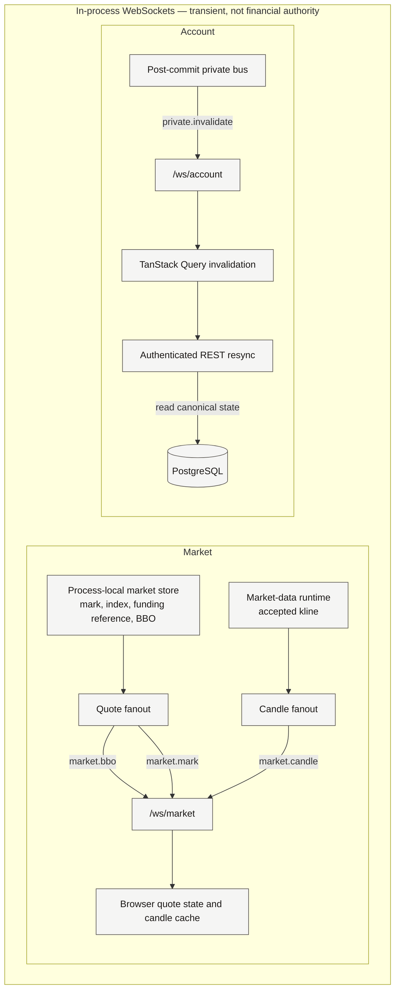

</details>

### `GET /ws/market`

Unauthenticated. Upgrade checks origin only.

Client messages: `market.subscribe`, `market.unsubscribe`, `market.candles.subscribe`, `market.candles.unsubscribe`, `ping`. Symbols must match `^[A-Z0-9]+$`. At most 50 quote subscriptions per connection.

Server messages: `hello`, `market.bbo`, `market.mark`, `market.candle`, `pong`, `error`.

`market.bbo` and `market.mark` are coalesced per symbol for about `WS_MARKET_COALESCE_MS` (default 100 ms). Coalescing is outbound only. It does not delay the store, the matcher, or trading freshness. A socket whose buffer exceeds 1 MiB skips a market frame and stays open. Quote payloads are decimal strings plus the exchange event time. They do not include local `receivedAt`.

The SPA reference-counts the market socket, pings every 15 seconds after hello, and resubscribes the selected symbol and candle interval after every fresh hello. Reconnect backoff starts at 1 second, caps at 30 seconds, and adds jitter. Close `1008` uses a slower floor.

### `GET /ws/account`

Upgrade requires a Better Auth session and an initialized paper account. Missing session is HTTP `401`. Missing initialization is HTTP `409 ACCOUNT_NOT_INITIALIZED`. The upgrade does not create a paper account, post signup allocation, or claim the faucet. The socket is bound to the server-resolved `{ userId, paperAccountId }`. At most four account sockets per paper account (`1008 CONNECTION_LIMIT`).

The only private application message is `private.invalidate`:

```text
{ eventId, occurredAt, resources, reason }
```

Resources: `account`, `orders`, `positions`, `executions`, `perpFunding`, `walletFunding`, `liquidations`, `marginSettings`.

Reasons include `ORDER_PLACED`, `ORDER_FILLED`, `ORDER_CANCELLED`, `LIMIT_MATCHED`, `LIQUIDATION`, `FUNDING_SETTLED`, `FAUCET_CLAIMED`, `MARGIN_SETTINGS_CHANGED`, and `ACCOUNT_INITIALIZED`.

The SPA invalidates the matching TanStack Query prefixes. It does not apply a financial DTO from the socket. After an account reconnect hello, it invalidates every private prefix, because there is no replay. Market subscribe messages on the account socket return `error` code `WRONG_CHANNEL`.

Private backpressure closes the connection with `4429` (`PRIVATE_BACKPRESSURE`) rather than dropping an invalidation. Idle timeout is `WS_IDLE_TIMEOUT_MS` (default 45 seconds) with close `4408`. A session that disappears is close `4401` (`AUTH_EXPIRED`); the SPA stops reconnecting and re-checks the session. Shutdown uses `1001`. Oversized or non-text frames use `1009` or `1003`. Inbound payloads are capped at 4096 bytes.

Publication runs only after `db.transaction` resolves. Rollback emits nothing. Nested funding settlement inside a placement transaction is folded into the same committed effect.

## 18. Frontend Architecture

`apps/web` is a Vite React SPA. Routes in `app/router.tsx`:

| Path | Access | Page |
| --- | --- | --- |
| `/` | Public | Landing |
| `/signin`, `/signup` | Auth layout | Email sign-in and sign-up |
| `/trade`, `/history`, `/account` | Session required | Trading terminal, history, account |
| anything else | | Not found |

`ProtectedRoute` uses `authClient.useSession()`. Unauthenticated users go to `/signin`. `AuthenticatedLayout` starts the market socket and mounts `AccountBootstrap`.

Bootstrap is REST: `GET /api/account`, then one `POST /api/account/initialize` on `409 ACCOUNT_NOT_INITIALIZED`. Sign-in and sign-up only establish the cookie and navigate. The account socket connects after bootstrap is ready.

Server state and local state are split:

| Store | Holds | Does not hold |
| --- | --- | --- |
| Better Auth client | Cookie session | A second copy of `GET /api/me` |
| TanStack Query | Account, instruments, candles, orders, positions, executions, both funding histories, liquidations, margin settings | Fill decisions |
| Zustand `useMarketStore` | Latest BBO and mark strings per symbol | Anything persisted |
| Zustand `useRealtimeStatusStore` | Socket protocol status | Financial amounts |
| React state | Forms, selected drawing, menus | Authoritative balances |
| `localStorage` | Theme, chart mode, indicator toggles | Orders, PnL, drawings |

Query `staleTime` defaults to 30 seconds. The instrument list on the trade page is cached longer. The positions table refetches every 1 second so unrealized PnL can move without a private event. The account page refetches every 60 seconds so `realizedPnl24h` rolls forward. Private invalidations and account reconnect call `invalidateQueries` on the affected keys. Mutations for place, cancel, faucet, margin, and initialize invalidate their own keys as well.

The API client (`lib/api/client.ts`) sends `credentials: "include"` and prefixes relative paths with `VITE_API_BASE_URL`, which must be an absolute `http` or `https` origin with no path. WebSocket URLs are that same origin with `ws` or `wss`.

The trade page (`TradePage`) selects an instrument from `GET /api/instruments` (`?symbol=`). The chart interval is `?interval=`. The order form submits side, `MARKET` or `LIMIT`, a positive decimal quantity string, a limit price when needed, and `reduceOnly`. It checks that the strings are plain positive decimals. It does not compute notional, margin, or PnL. Margin controls read and write `{ marginMode, leverage }` through the margin-settings API. The positions table renders server strings, including a dash when `unrealizedPnl` is null. Sign coloring uses decimal string comparison, not a recomputed PnL.

History is an authenticated page with URL tabs for orders, executions, perpetual funding, and liquidations, optional symbol and status filters, and offset pages of 50.

The landing page is educational. It may subscribe to `/ws/market` for a public quote strip. Its leverage lab calls `@notional/trading` to illustrate notional, margin, and maintenance on user-typed examples. Those figures are not the user's paper account and are not sent to the API.

A `401` from the API client signs the user out. Account-socket authentication expiry does the same after a session probe.

## 19. Database Design

Drizzle schema is `packages/db/src/schema`. Migrations are checked-in SQL under `packages/db/drizzle`. Production applies them with the compiled migrator (`migrate:prod` / the API image entrypoint). `drizzle-kit push` is not the production path. Financial numeric columns are `NUMERIC(38,18)` strings. Timestamps in this schema are `timestamp` without time zone; the application writes and reads them as UTC. Solid edges in the figure are actual foreign keys. `account` is Better Auth credentials, not `paper_account`.


<details>
<summary>View Mermaid source</summary>

```mermaid
flowchart TB
  subgraph auth["Better Auth"]
    direction LR
    userNode[user]
    sessionNode[session]
    credNode["account — credentials, not paper_account"]
    verifyNode["verification — no foreign key"]
    userNode -->|"user_id"| sessionNode
    userNode -->|"user_id"| credNode
  end

  subgraph trading["Trading"]
    paperNode[paper_account]
    instrumentNode[instrument]
    orderNode[trade_order]
    positionNode[trading_position]
    executionNode[execution]
    liqNode[liquidation_event]
    paperNode -->|"paper_account_id"| orderNode
    paperNode -->|"paper_account_id"| positionNode
    paperNode -->|"paper_account_id"| liqNode
    instrumentNode -->|"instrument_id"| orderNode
    instrumentNode -->|"instrument_id"| positionNode
    instrumentNode -->|"instrument_id, nullable"| liqNode
    orderNode -->|"order_id"| executionNode
    liqNode -->|"liquidation_event_id, nullable"| orderNode
  end

  userNode -->|"user_id"| paperNode

  subgraph ledger["Ledger"]
    txnNode[ledger_transaction]
    lacctNode["ledger_account<br/>system rows: paper_account_id null"]
    entryNode[ledger_entry]
    feventNode["funding_event"]
    txnNode -->|"ledger_transaction_id"| entryNode
    lacctNode -->|"ledger_account_id"| entryNode
    txnNode -->|"ledger_transaction_id"| feventNode
  end

  paperNode -->|"paper_account_id"| txnNode
  paperNode -->|"paper_account_id, nullable"| lacctNode
  paperNode -->|"paper_account_id"| feventNode

  subgraph funding["Perpetual Funding"]
    srcNode[perp_funding_source_state]
    cycleNode[perp_funding_cycle]
    asetNode[perp_funding_account_settlement]
    psetNode[perp_funding_settlement]
    cycleNode -->|"funding_cycle_id"| psetNode
    asetNode -->|"account_settlement_id"| psetNode
  end

  instrumentNode -->|"instrument_id"| srcNode
  instrumentNode -->|"instrument_id"| cycleNode
  paperNode -->|"paper_account_id"| asetNode
  paperNode -->|"paper_account_id"| psetNode
  positionNode -->|"position_id"| psetNode

  classDef neutral fill:#f5f5f4,stroke:#57534e,color:#1c1917
  class userNode,sessionNode,credNode,verifyNode,paperNode,instrumentNode,orderNode,positionNode,executionNode,liqNode,txnNode,lacctNode,entryNode,feventNode,srcNode,cycleNode,asetNode,psetNode neutral
```

</details>

`user`, `session`, `account`, and `verification` are Better Auth. Domain tables reference `user.id` with `ON DELETE RESTRICT` from `paper_account`, so deleting a user cannot silently drop financial identity. Session and credential rows cascade from `user`.

Notable constraints:

- `paper_account.user_id` unique. `currency = 'USDT'`. `balance >= 0`. Status `ACTIVE` or `SUSPENDED`.
- `instrument.symbol` unique and uppercase. Quote `USDT`. Contract `PERPETUAL`. Status `ACTIVE` or `INACTIVE`. Filter checks as in ADR-014. No `max_price >= min_price` check. Price-filter zeros mean a disabled Binance sub-rule.
- `trading_position` unique on `(paper_account_id, instrument_id)`. Quantity and entry are exclusive as in section 13. Leverage `BETWEEN 1 AND 100`. Cross implies `isolated_margin = 0`. Isolated and flat implies `isolated_margin = 0`. Isolated and open implies `isolated_margin >= 0`.
- `trade_order` unique on `(paper_account_id, idempotency_key)`. Market rows have null limit price. Limit rows have a positive limit price. `reserved_margin` is 0 unless the row is an `OPEN` non-reduce limit, in which case it is `> 0`. `origin` is `USER` or `LIQUIDATION`.
- `execution.order_id` unique. Quantity and price `> 0`.
- `ledger_account.kind` is `USER_CASH`, `SYSTEM_VIRTUAL_FUNDING`, `SYSTEM_TRADING_PNL`, `SYSTEM_INSURANCE`, or `SYSTEM_FUNDING`. User cash belongs to one paper account. System kinds are global (`paper_account_id` null).
- `ledger_transaction.paper_account_id` is `NOT NULL` and is the ownership authority (ADR-041). Event types: `SIGNUP_ALLOCATION`, `FAUCET_CLAIM`, `REALIZED_PNL`, `FUNDING_PAYMENT`. `idempotency_key` is unique. Entry amounts are non-zero signed decimals. Posted entries sum to zero by application convention. The database does not store a debit/credit flag.
- `funding_event` is signup and faucet only, with a unique idempotency key and a unique link to its ledger transaction. At most one signup allocation per paper account.
- `liquidation_event.instrument_id` is null for `CROSS` and required for `ISOLATED`.
- Perpetual funding tables are unique on instrument plus funding time, and on paper account plus funding time. A `READY` cycle requires a rate with absolute value below 1 and a positive mark.

`ledger_transaction.paper_account_id` was added so insurance-only realized-PnL rows, which can omit `USER_CASH`, still have an owner. Do not infer ownership by parsing idempotency keys.

## 20. Deployment Architecture

What the repository actually defines:

**Local development.** `docker-compose.yml` runs PostgreSQL 17 (`notional-postgres`, host port 5433) and Redis 7 (`notional-redis`). An init script creates `notional_test`. The API and SPA run on the host (`pnpm dev:api`, `pnpm dev:web`) against `localhost:3000` and `localhost:5173`. Redis is unused. `REDIS_URL` is documented as unused.

**Production process model (ADR-038).** One static SPA, one API process, one PostgreSQL database, and Binance public REST/WebSocket. One API replica is required. The matcher, scanners, market store, and WebSocket fanout are in memory in that process. A second API replica would split the book, double-fill resting orders, and fork the sockets. PostgreSQL uniqueness would still prevent duplicate ledger keys, but it would not make two matchers correct.

**Images.**

- `apps/api/Dockerfile` — multi-stage Node 22 build, `pnpm --filter=api --prod --legacy deploy`, non-root user, entrypoint runs the compiled migrator and then `exec node dist/server.js`. `MIGRATION_DATABASE_URL` is unset after migrate so the long-running process keeps `DATABASE_URL`. Listens on 3000.
- `apps/web/Dockerfile` — builds the SPA with required `VITE_API_BASE_URL`, then copies it into nginx 1.27. Listens on 80. `apps/web/nginx.conf` proxies `= /api`, `/api/`, `= /health`, `= /ready`, `= /ws/market`, and `= /ws/account` to `notional-api:3000` without stripping `/api`. WebSocket locations set `Upgrade`, disable buffering, and use 120 second proxy timeouts. `/assets/` is immutable and 404 when missing. Other paths fall back to `index.html`. Static responses send nosniff, `X-Frame-Options: DENY`, a referrer policy, a camera/microphone/geolocation Permissions-Policy, and HSTS `max-age=15552000`. There is no Content-Security-Policy.

**Local production-like wiring.** `docker-compose.prod.yml` builds the API image and PostgreSQL only. It does not build the web image and it does not start Redis. Origins are placeholder HTTPS values so production env parsing can start. It is not a cloud topology and not a representative cookie login through localhost.

**Health.** `GET /health` returns `{ status: "ok" }` if the process can answer. `GET /ready` returns 503 unless startup finished, shutdown has not started, and `checkDatabaseHealth` succeeds. Stale Binance data does not flip `/ready`. Financial routes still fail closed on their own.


<details>
<summary>View Mermaid source</summary>

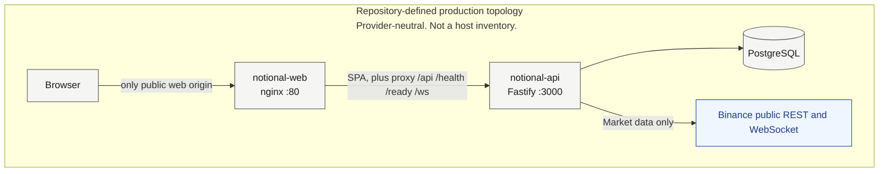

</details>

**Current demo environment.** The current demo is deployed on Northflank using that topology: `notional-web` is public, `notional-api` is private, and PostgreSQL is the addon. One web instance and one API instance remain required. The public web deployment has been browser smoke-tested. Binance remains public market data only.

**Northflank demo (ADR-040).** The demo uses the diagram above: public `notional-web`, private `notional-api` (`public=false`), one PostgreSQL 17 addon, no Redis, one instance each, `TRUST_PROXY=false`, and nginx stripping forwarded headers. ADR-039 selected Render earlier, was never deployed, and is superseded. ADR-038 remains the provider-independent operations model.

Database TLS is whatever `DATABASE_URL` already contains (`sslmode` and similar). The app does not add `DATABASE_SSL` and does not set `rejectUnauthorized: false`.

Same-site cookies are required. The supported production cookie topology is one HTTPS origin (web and API behind the nginx proxy) or sibling HTTPS subdomains. The cookie stays host-only. Unrelated sites will not send `SameSite=Lax` cookies.

## 21. Failure Handling and Consistency

PostgreSQL is authoritative for financial state after a successful commit. The market store, WebSocket buffers, and TanStack Query cache are not.

| Failure | Behavior |
| --- | --- |
| Transaction throw | Rollback. No order, execution, position, wallet, or ledger fragment remains. The HTTP error is the mapped domain code, or `500` if it is unexpected |
| Realtime publish after commit | Logged and swallowed. The financial commit stands. The client catches up on refetch, reconnect invalidation, or the next successful event |
| Stale or missing mark or book | The operation that needs it returns `MARKET_DATA_UNAVAILABLE` or, in the matcher and liquidation scanner, skips that candidate. `/ready` stays up |
| Binance REST or WebSocket down | Catalog sync and funding reconcile log and retry on their intervals. The in-memory book ages stale. New risk and new fills fail closed. Existing PostgreSQL state is unchanged |
| Funding window not proven | User placement, faucet, and matcher fills roll back with `FUNDING_DATA_UNAVAILABLE`. The funding scanner skips that account. Liquidation treats it as a no-op for that attempt |
| WebSocket disconnect | Browser reconnects with backoff, waits for `hello`, resubscribes market data, and invalidates private REST queries. Missed invalidations are not replayed |
| Rejected order | No `trade_order` row. The idempotency key remains available |
| Duplicate `Idempotency-Key` with the same fingerprint | `200` and the original order. A filled order is not re-priced |
| Duplicate key with a different fingerprint | `409 IDEMPOTENCY_KEY_REUSED` |
| Matcher cannot fill one resting order | That candidate rolls back and stays `OPEN`. Later candidates in the symbol still run |
| Two liquidations of the same account | The account row lock serializes them. The second attempt sees flat positions or an already closed book |
| Cancel versus fill | Both lock the order row when the fill path is the matcher. Fill-first makes cancel `ORDER_NOT_CANCELLABLE`. Cancel-first makes the fill `ORDER_ALREADY_CANCELLED` |
| Process crash | Committed rows remain. In-memory quotes, live schedule proofs, coalesced socket frames, and in-flight matcher cycles are gone. Restart bootstraps market data and resumes scanners. Funding proof must be rebuilt before interactive mutations will pass the barrier |

Partial trading effects across tables are not a supported outcome. The fill path does not commit the execution and then apply the position in a second transaction.

## 22. Security Boundaries

Implemented boundaries:

- Session cookie is HttpOnly, `SameSite=Lax`, `Path=/`, host-only, and `Secure` when the auth URL is HTTPS. Application JavaScript does not read it.
- CORS allows exactly `WEB_ORIGIN` and credentialed requests. Better Auth `trustedOrigins` is that same origin.
- Browser WebSocket `Origin` must equal `WEB_ORIGIN`.
- Authenticated routes use `requireAuth`. Account data is scoped by the session's paper account. A foreign order or position id is not found.
- `/ws/account` resolves the user on the server during upgrade and does not trust a user id in the socket URL or in a message.
- Order bodies are Zod-validated. Unknown margin-settings fields are rejected. Idempotency keys are restricted to printable non-whitespace ASCII.
- The API is the only Binance client. No exchange credential exists in the app. Users cannot submit an execution price.
- Rate limits slow credential stuffing and request floods. The faucet cooldown and the ledger unique keys remain the financial controls.
- nginx on the SPA image sends framing and content-type protections. API Helmet sets API headers. CSP is not configured.
- With `TRUST_PROXY=false`, forwarded headers are not trusted. The web image nginx config clears `X-Forwarded-For`, `X-Forwarded-Host`, `X-Forwarded-Proto`, and `Forwarded`.
- There is no custody key, withdrawal address, or blockchain signer.

The product is still a paper simulator. These controls protect the demo account and the session. They do not make the balances real funds.

## 23. Key Architectural Decisions

`docs/decisions.md` is the decision record. This section only points at the decisions the running system embodies. It does not replace the ADRs.

| ADR | Status | What the system does because of it |
| --- | --- | --- |
| ADR-001 PostgreSQL over MongoDB | Accepted | Financial state is relational and transactional. PostgreSQL is authoritative |
| ADR-002 Modular monolith | Accepted | One Fastify process. No microservices |
| ADR-003 React + Vite | Accepted | Standalone SPA. Not Next.js |
| ADR-004 One net position per instrument | Accepted | Identity `(account_id, instrument_id)`. Signed quantity |
| ADR-005 No partial fills in MVP | Accepted | `UNIQUE(execution.order_id)`. One full fill |
| ADR-006 USDT-only collateral | Accepted | `CHECK (currency = 'USDT')`. No multi-currency wallet |
| ADR-007 No margin tiers | Accepted | One leverage and maintenance model |
| ADR-008 Better Auth with PostgreSQL sessions | Accepted | Cookie sessions. No application JWT |
| ADR-009 Paper account as the financial identity | Accepted | `paper_account` is not Better Auth `account` |
| ADR-010 Signup allocation ledger | Accepted | 1000 USDT, idempotent initialize, auth commit is outside the financial transaction |
| ADR-011 Virtual faucet | Accepted | Configurable amount, 24-hour database cooldown |
| ADR-012 through ADR-015 Instrument identity and filters | Accepted | Symbol is the Binance symbol. Catalog metadata only. No deletes |
| ADR-016 Public Binance USD-M market data only | Accepted | No signed Binance API |
| ADR-017 Price-source roles | Accepted | Ask, bid, mark, and funding mark are different |
| ADR-018 Ephemeral in-process market state | Accepted | Quotes are not in PostgreSQL and not in Redis |
| ADR-019 Fail-closed freshness | Accepted | Receive-time freshness. Book ordered by update id |
| ADR-020 and ADR-021 Catalog snapshot and crypto filter | Accepted | Atomic sync. `underlyingType === "COIN"` |
| ADR-022 WebSocket routing and bookTicker | Accepted | `/market` and `/public`. Per-symbol book ticker |
| ADR-023 Exact decimal architecture | Accepted | `TradingDecimal` precision 80, half-even |
| ADR-024 Signed net position and PnL | Accepted | `applyFillToPosition` is the only fill application |
| ADR-025 and ADR-028 Filter arithmetic and validation prices | Accepted | Limit versus mark versus BBO are not mixed |
| ADR-026 and ADR-027 Order identity and idempotency | Accepted | `trade_order` plus client idempotency key |
| ADR-030 Immutable executions | Accepted | No client fill-price endpoint |
| ADR-031 Persistent net positions | Accepted | Row survives flat. Cumulative realized PnL |
| ADR-032 Margin mode and leverage | Accepted | Settings on `trading_position` |
| ADR-033 Atomic cross trading | Accepted | Public `POST /api/orders` and the matcher |
| ADR-034 Liquidation and isolated trading | Accepted | Maintenance rate `0.005`. Isolated reverse unsupported |
| ADR-035 Perpetual funding settlement | Accepted | Binance realized rate and mark kline |
| ADR-036 Realtime browser fanout | Accepted | `/ws/market` and `/ws/account`, protocol 1 |
| ADR-037 Frontend server-state ownership | Accepted | REST authority, query cache, ephemeral quotes. The SPA does import `@notional/trading` for display and the landing lab. See section 4 |
| ADR-038 Production operations | Accepted | One API replica, compiled migrator, `/health` versus `/ready` |
| ADR-039 Render | Superseded | Not deployed. Kept as history |
| ADR-040 Northflank Developer Sandbox | Accepted, demo deployed | Zero-cost demo topology |
| ADR-041 Ledger paper-account attribution and realized PnL 24h | Accepted | `ledger_transaction.paper_account_id` and `realizedPnl24h` |

ADR-031's response-field list is older than `packages/contracts/src/position.ts`. The live position payload includes mark, unrealized PnL, margin mode, and leverage, computed or copied at read time.

## 24. Current System Boundaries

Notional **is**:

- A paper perpetual simulator for USDT-margined crypto linear perpetuals
- A virtual USDT ledger with a signup grant and a faucet
- A consumer of live public Binance market data
- An internal paper execution, margin, funding, and liquidation engine
- A modular monolith: one API process, one PostgreSQL database, one SPA

Notional **is not**:

- A real exchange, or a venue where users match each other
- A custodian, wallet, payment processor, or withdrawal system
- A blockchain application
- A real-money broker
- A Binance order-routing client
- A system with fees, partial fills, take-profit or stop-loss orders, ADL, margin tiers, or a liquidation fee
- A system that supports isolated position reversal
- A multi-process matcher or a multi-process WebSocket tier

Redis in local Compose is not part of this behavior.

## 25. Future Scaling Considerations — Not Current Architecture

The current system is one API process on purpose. The notes below are possible later evolutions. They are not implemented, and Redis is not a stepping stone that already holds financial state.

- **Multiple API instances** would require the market store, matcher, liquidation scanner, funding scanner, and WebSocket fanout to leave process memory, or to be elected so that only one instance runs them. PostgreSQL row locks would still serialize an account, but two matchers watching two copies of the book would not be correct.
- **WebSocket fan-out** could move to a non-authoritative pub/sub tier. Financial writes would still commit to PostgreSQL first, and clients would still REST-resync. Local Compose Redis is only a reserved option for that kind of non-authoritative role.
- **Market-data worker separation** could isolate Binance reconnects from HTTP, as long as every trading process still fails closed when its view of mark or BBO is stale.
- **Caching** of public candles or instrument metadata could sit in front of Binance reads. It would not be allowed to answer a freshness check for execution.
- **Event streaming** could carry post-commit invalidations. It would not become the ledger.
- **History partitioning** could matter for `execution`, `ledger_entry`, and funding settlement tables. It would not change the one-fill-per-order rule without an explicit migration of `UNIQUE(order_id)`.
- **Dedicated execution or risk services** would still need the same lock order and the same single-transaction fill effects. Splitting them without a shared transaction would break the exactly-once guarantee the monolith has now.

None of these are a reason to run a second API replica today.

## 26. End-to-End Summary

Market data:

```text
Binance public REST and WebSocket
  → Notional API market store
  → GET /api/market-data and GET /ws/market
  → browser
```

The browser does not open a Binance connection.

Trading:

```text
Browser
  → Notional API
  → session check, idempotency, funding barrier, risk and trading math
  → one PostgreSQL transaction
  → post-commit /ws/account invalidation
  → browser refetches REST
```

No user paper order is ever routed to Binance. A fill is an internal execution at the public best bid or best ask, persisted only in Notional's database.
